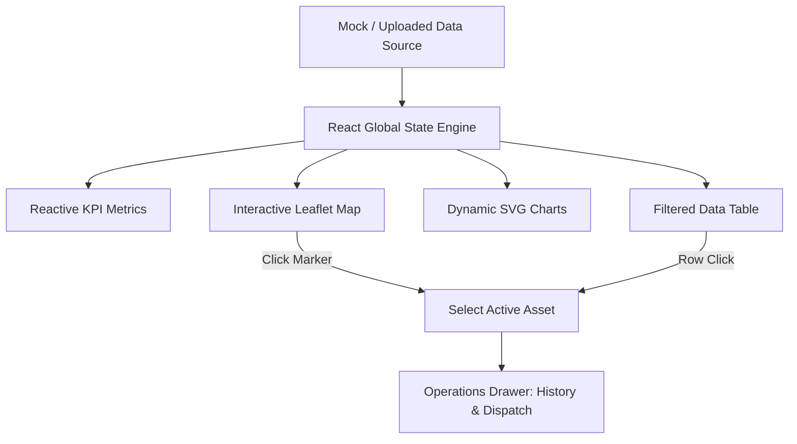

# Case Study: GIS Field Operations & Asset Tracking Dashboard

This case study is formatted for freelance portfolios (e.g., Contra, Upwork, PeoplePerHour) to highlight technical capabilities in **GIS visualization**, **React/Next.js frontend development**, **data validation/cleaning**, and **dashboard user experience (UX)**.

---

## 📌 Project Overview
* **Role**: Lead Frontend / GIS Developer
* **Deliverables**: Interactive Map Console, Operational KPI Suite, Client-side CSV/JSON Data Validator, and Real-Time SCADA Simulator.
* **Target Industry**: Municipal Utilities, Telecommunications, Smart City Operations, Logistics & Field Service Management.
* **Key Achievements**: Built a responsive, zero-build-error interactive dispatcher app that handles live map synchronizations, processes uploads with diagnostic checking, and calculates KPIs reactively.

---

## 💼 The Business Problem
Infrastructure operators (telecom, gas, water, electric) often rely on fragmented spreadsheets, static maps, or legacy systems to manage physical assets. This fragmentation creates several operational challenges:
1. **Delayed Incident Response**: When a SCADA alarm occurs, dispatchers waste critical minutes cross-referencing sensor IDs with separate coordinate databases.
2. **Inefficient Resource Allocation**: Field crews are dispatched without visual grouping, causing overlapping routes and high travel overhead.
3. **Bad Data Quality**: Field logs uploaded by technicians frequently contain missing GPS values, typos, or wrong category names, breaking internal visualization engines.

---

## 🛠️ The Solution: Unified Dispatch Console
I engineered a high-performance, single-page operations hub that aggregates geographic coordinates, metadata fields, and maintenance ledgers into one interactive map dashboard.

### Technical Highlights

#### 1. Performance-First Leaflet GIS Integration
Standard map implementations often experience lagging render cycles and broken image paths when loaded inside React frameworks.
* **Solution**: Initialized Leaflet inside a dynamic browser-only component wrapper (`ssr: false`) to avoid hydration failures. Instead of standard raster image markers which fail to bundle correctly, I designed **100% vector-based Custom `DivIcons`** styled with Vanilla CSS animations.
* **Result**: Rendered 50+ localized assets with smooth pan-to-focus transition effects and neon glow state indicators (including a pulsing state for critical alarms) that loads instantaneously.

#### 2. Client-Side CSV/JSON Sanitization Engine
Clients frequently need utility apps that let non-technical coordinators load spreadsheets directly.
* **Solution**: Developed a custom regex-based parser that handles raw `.csv` or `.json` files. The engine extracts rows, strips quotes, typecasts string numbers into valid floats, and performs strict validation:
  * Verifies coordinates (latitude and longitude) are valid bounding box numbers.
  * Discards incomplete schemas and throws helpful, line-numbered diagnostic errors.
  * Autogenerates IDs and default log entries for incomplete technician logs.

#### 3. Zero-Dependency SVG Analytics
Using heavy charting libraries (like Chart.js or Recharts) increases bundle size by hundreds of kilobytes and often causes rendering glitches in grid layouts.
* **Solution**: Coded custom React SVG elements to calculate segment angles on a circumference ($2 \pi r$) for the status breakdown donut chart, and flex-height columns for the utility distribution bar graph.
* **Result**: Clean, responsive animations with zero bundle overhead.

---

## 📈 Freelance-Relevant Capabilities Demonstrated
This project serves as direct proof of competency for high-value client requests:

| Freelance Job Category | How This Project Proves Competency |
| :--- | :--- |
| **GIS / Map Visualizations** | Integrates interactive maps, coordinates centering, custom status-coded vectors, and map markers popups. |
| **Operations Dashboards** | Creates layouts mapping real-world field technician dispatcher flows: alert levels, technician assignments, and timeline logging. |
| **Data Cleaning & Pipelines** | Custom-built CSV import parsing checks, coordinates sanitization, and JSON formatting exports. |
| **Modern UX/UI Engineering** | Built in beautiful dark mode with glassmorphic elements, hover highlights, reactive tab switching, and custom micro-animations. |

---

## 💡 Key Lessons & Architectural Decisions
* **SSR Safety in Next.js**: Leaflet depends directly on browser-only Web APIs (like `window`). Dynamically importing the map with Next's `{ ssr: false }` option allowed the rest of the application to pre-render statically while lazy-loading mapping services.
* **Separation of Styling Concerns**: Using Vanilla CSS variables for status colors (`--status-urgent`, `--status-active`) made it extremely simple to sync color representations across the map markers, the SVG slices, the data table cells, and the KPI card headers.
